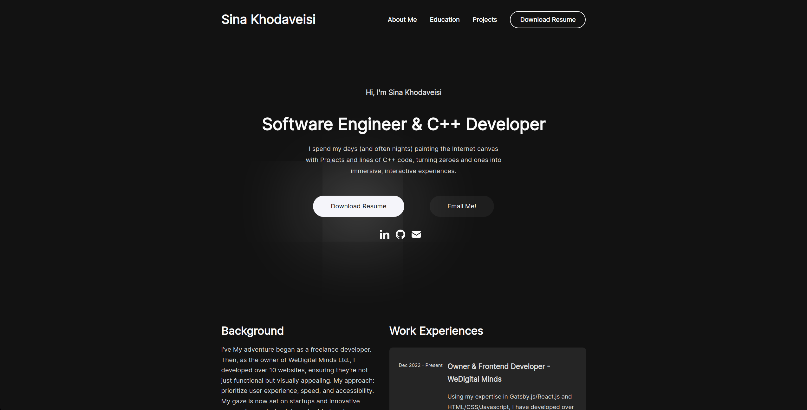

# Sina Khodaveisi Portfolio Website



This is the repository for my personal portfolio website built with Gatsby.js, GraphQL, Framer Motion, and MDX.

## Table of Contents
- [Introduction](#introduction)
- [Features](#features)
- [Installation](#installation)
- [Usage](#usage)
- [Dependencies](#dependencies)
- [Contributing](#contributing)
- [License](#license)

## Introduction

Welcome to my personal portfolio website! This website showcases my projects, educational background, and provides a glimpse into my professional journey. It's built using modern web technologies and aims to provide an engaging and interactive experience for visitors.

You can access the live website at [https://sina.khodaveisi.com](https://sina.khodaveisi.com).

## Features

- **Interactive Design**: The website is designed with user interaction in mind, making it engaging and fun to navigate.
- **Projects Showcase**: Display your projects with images and descriptions.
- **About Me**: Share information about yourself, your skills, and your interests.
- **Education**: Highlight your educational background and qualifications.
- **Responsive**: The website is responsive and looks great on various devices, including desktops, tablets, and smartphones.

## Installation

1. Clone the repository.

```bash
git clone 
```

2. Navigate to the project directory.

```bash
cd portfolio-gatsby-minimal 
```

3. Install dependencies.

```bash
npm install --force
```

4. Run the code.

```bash
gatsby develop
```

## Usage

1. Start the development server.

2. Open your browser and visit the website locally.

## Dependencies

Key libraries and packages used in this project:

- **Gatsby**: Static site generator for React.
- **GraphQL**: Query language for API data fetching.
- **Framer Motion**: Animation library for React.
- **MDX**: Markdown for the component era.
- **Styled Components**: Styling library for CSS-in-JS.

For the complete list of dependencies and their versions, please refer to the `package.json` file in the project root.

## Contributing

Contributions are welcome! If you'd like to contribute to this project, please follow the standard GitHub fork and pull request workflow.

## License

This project is licensed under the MIT License - see the [LICENSE](LICENSE) file for details.
